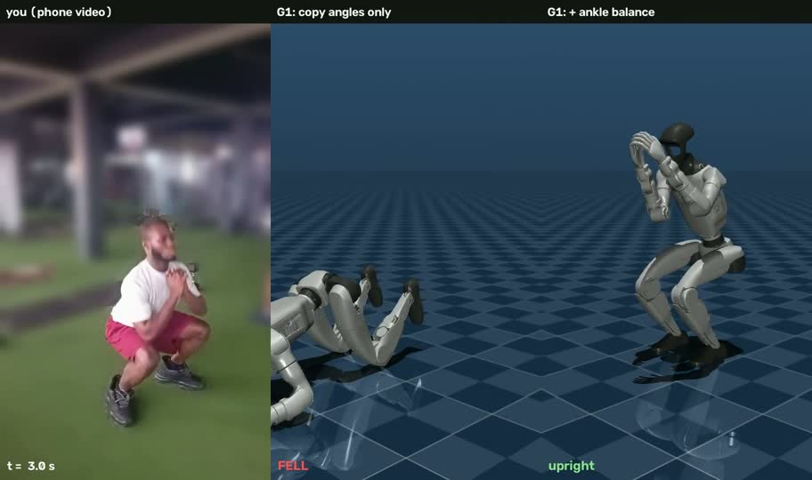

# Phone to Humanoid

Can a humanoid robot copy an athlete from ordinary phone video? This project films a drill on a phone, turns it into 3D joint angles, replays it on a simulated Unitree G1, and measures where the copy breaks.



*Bodyweight squat, 3 s in. Middle: the G1 driven only by my joint angles has already fallen. Right: the same targets plus a simple ankle balance rule, still squatting. Everyone but the athlete is blurred.*

## First result: the squat

Filmed on a phone at about 45°, 8 full reps in 17 s.

| Stage | Result |
|---|---|
| Human consistency | Reps differ by about 2° after dynamic time warping (DTW) alignment |
| Pose replay, no physics | Every frame fits the G1's joint limits. The ankle needs up to 38.7° of shin-forward tilt (limit 50°), and the centre of mass stays over the feet, with a 2 cm margin at the bottom. |
| Physics, joint angles only | **Falls forward at 1.2 s**, at the bottom of the first squat (2.7 s with the robot's default arms) |
| Physics + ankle balance feedback | **Upright through all 8 squats**, with up to 17° of ankle correction, but the feet shuffle back about 65 cm. Stricter contact settings don't change this. |
| Balance-aware retargeting | Tilting each pose so the centre of mass sits over mid-foot (about 2.5° of extra lean) still falls without feedback |

**In short:** the squat is kinematically feasible but dynamically unstable for the G1 when it only copies joint angles. A simple ankle strategy prevents the fall but not the foot shuffle. Standing still and balanced needs a whole-body balance controller. The full write-up is in [results/FINDINGS.md](results/FINDINGS.md), with a one-page PDF version in [results/Phone2Humanoid_findings.pdf](results/Phone2Humanoid_findings.pdf).

Videos: [physics comparison](media/squat_G1_physics_compare.mp4) · [pose replay](media/squat_G1_pose_replay.mp4) · [skeleton tracking](media/squat_45deg_skeleton.mp4)

## How it works

1. **Pose.** MediaPipe Pose Landmarker (heavy model) estimates 33 3D landmarks in every frame.
2. **Angles and reps.** Knee, hip and trunk lean are computed, smoothed and split into reps. Reps are compared with DTW, the method from my B.Sc. thesis on remote physiotherapy monitoring.
3. **Retargeting.** The angles drive a Unitree G1 (MuJoCo Menagerie model, 29 joints). Each joint's sign convention was measured on the model (`src/g1_probe.py`). The ankle is solved so both feet stay flat, and the body is shifted so the feet stay planted.
4. **Physics.** The G1's position actuators track those targets under gravity and contact, with and without an ankle balance rule.
5. **Privacy.** A person segmentation mask keeps the athlete sharp and blurs everyone else in every shared video.

## Run it

Python 3.10–3.12 (MediaPipe has no 3.13 build yet) and ffmpeg for the browser-friendly video copies.

```bash
pip install -r requirements.txt
python setup_assets.py            # pose model + the Unitree G1 folder from MuJoCo Menagerie
# put your clip at data/oblique45.mp4 (film at about 45 degrees, whole body in frame)
python run_all.py oblique45       # about 10 minutes on a laptop CPU
```

Results land in `outputs/`. To run the first half (pose, angles, reps, DTW, and a G1 joint-limit check) in Google Colab with no setup, open `notebooks/Phone2Humanoid_Week1.ipynb`.

## Layout

```
run_all.py              one command, whole pipeline
setup_assets.py         downloads the pose model and the G1 model
src/p2h.py              pose -> angles -> reps -> DTW
src/privacy_blur.py     blur everyone except the athlete; skeleton overlay
src/g1_probe.py         measures the G1's joint sign conventions
src/g1_retarget.py      human angles -> G1 joints; kinematic replay video
src/g1_physics.py       physics experiments and the three-panel video
notebooks/              Colab notebook for the first half
results/                findings, figures, numbers
media/                  blurred result videos
```

## Limitations

- So far: one athlete, one movement, one camera angle. A front-on view reads the squat about 14° deeper, and it reads straight standing knees as bent, so camera placement matters.
- Angles are zeroed at the athlete's standing posture, because one camera reads a straight knee as about 18° bent.
- Arms copy shoulder and elbow angles, not hand positions. The G1's long arms relative to its torso put its hands higher than the athlete's.
- The Menagerie G1 has unlimited actuator torque and untuned PD gains, so a real robot would find this harder.

## Next

Forward lunge, arm raise and instep kick, with more athletes. After that, a learned balance policy for the movements that fall, compared on the same two numbers: time to fall and foot slide.

## Built on

[MediaPipe](https://github.com/google-ai-edge/mediapipe) · [MuJoCo](https://github.com/google-deepmind/mujoco) · [MuJoCo Menagerie](https://github.com/google-deepmind/mujoco_menagerie) (Unitree G1 model, BSD-3-Clause). Related work that does this at scale with learning: [VideoMimic](https://github.com/hongsukchoi/VideoMimic) (CoRL 2025) and [ASAP](https://www.ri.cmu.edu/robots-with-moves-like-ronaldo-lebron-and-kobe/) (RSS 2025).

Samuel Ogundipe · samuel.t.ogundipe@gmail.com · MIT License
